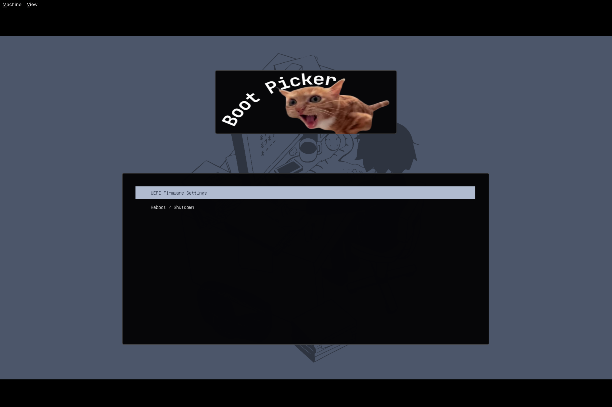

# Custom Grub Theme

## Table of Contents

| Category                   | Description                                 |
| -------------------------- | ------------------------------------------- |
| [What does it do?](#looks) | What is this?                               |
| [Installation](#install)   | Directions to clone and use this repository |

## What is this?
I'm tired of looking at the default GRUB boot menu. But, I can't find any themes that I like either... so I've decided to make one myself!

Can you tell that I've never taken a UI/UX design class before?

## Installation
This was originally supposed to be used in a Ventoy installation, the steps of which can be found [here](https://www.ventoy.net/en/plugin_theme.html). However, you can also use this in your typical ever-day boot loader as well!S

